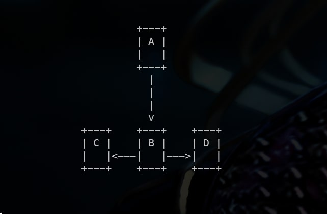

<h1>Flowcharts</h1>

Create simple flowcharts and render them in terminal

    
<h2>Usage</h2>
<pre><code>go get github.com/Ha4sh-447/flowcharts</code></pre>
    
<h2>Example</h2>
<h4>example.go</h4>
<pre><code>go run example.go</code></pre>
    

    

This project can be extended to create hand drawn images of flowchart.

